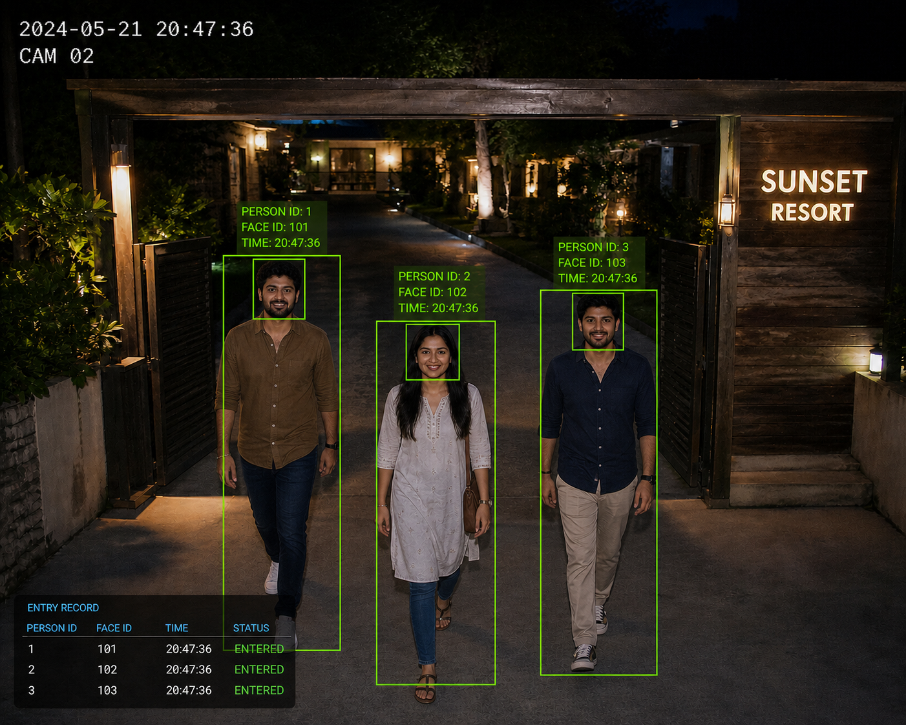

# Face_Rec_Siddu: Advanced Face Recognition System

A high-performance Python face recognition and detection system built for real-time monitoring, video analysis, and identity verification. This project extends standard implementations with optimized processing, intelligent storage, and quality filtering.

---

## Key Features

- **Real-Time Webcam Recognition**
  - Optimized processing using frame skipping for higher FPS.

- **Intelligent Tiered Storage**
  - Automatically classifies detected faces into:
    - `known` → High confidence matches  
    - `verification` → Medium confidence (needs review)  
    - `unknown` → Low confidence or new faces  

- **Blur Filtering**
  - Uses Laplacian variance to discard low-quality (blurry) frames.

- **Image & Video Analysis**
  - Supports both static image and video processing with bounding boxes and confidence scores.

- **Precomputed Encodings**
  - Uses `encodings.pkl` for faster startup and recognition.

---

## Table of Contents

- Installation
- Quick Start
- Webcam Monitoring
- Image & Video Processing
- Project Structure
- License

---

## Installation

```bash
# Clone repository
git clone https://github.com/Siddeshmoghavera/Face_Rec_Siddu.git
cd Face_Rec_Siddu

# Create virtual environment (recommended)
python -m venv venv

# Activate environment
# Windows
venv\Scripts\activate

# macOS/Linux
source venv/bin/activate

# Install dependencies
pip install -r requirements.txt


## Requirements

- Requires `opencv-python`, `dlib`, and `face_recognition`
- On Windows, install Visual C++ Build Tools if `dlib` installation fails

---
## Quick Start

```bash
python examples/facerec_from_webcam_faster.py

-Starts webcam detection
- Displays bounding boxes
- Saves detected faces automatically

-Press ESC to exit.


##Usage: Advanced Webcam Monitoring

The `facerec_from_webcam_faster.py` script is designed for production-like environments where you need to track guests or staff.

- **Face Tracking**: Assigns a unique `face_id` to each person in the frame and tracks them across frames.
- **Best-Frame Selection**: Only saves the highest confidence, least blurry image of a person within a configurable cooldown period.
- **Verification Queue**: Outputs a structured queue of faces that need manual review (useful for integrating with a Manager Dashboard).

*Captured images are saved with timestamps in the `examples/captured_faces/` directory.*
```

## Usage: Image & Video Processing

If you need to analyze static files, use the provided CLI or example scripts:

**Process a single image:**
```bash
python examples/check_person_image_with_boxes.py
```

**Process a video file:**
```bash
python examples/check_person_video_with_boxes.py
```
*The scripts will load known faces, prompt you for the input file, and save an annotated version in the `tests/test_images/test/` directory.*

**Command Line Interfaces:**
You can also use the built-in CLIs for quick terminal outputs:
```bash
python face_recognition/face_detection_cli.py --image path/to/image.jpg
python face_recognition/face_recognition_cli.py --image path/to/image.jpg --known-dir path/to/train
```

## Project Structure

```text
Face_Rec_Siddu/
├─ face_recognition/               # Core library files and CLI tools
├─ examples/                       # Main application scripts
│  ├─ facerec_from_webcam_faster.py # 🌟 Advanced live webcam monitor
│  ├─ check_person_image_with_boxes.py
│  ├─ check_person_video_with_boxes.py
│  ├─ encodings.pkl                 # Cached face encodings
│  └─ captured_faces/               # Auto-generated categorized captures
│     ├─ known/
│     ├─ unknown/
│     └─ verification/
├─ tests/                          
│  └─ test_images/                 # Sample images, training data, and outputs
├─ setup.py                        # Installation script
├─ requirements.txt                # Python dependencies
└─ README.md                       # This documentation
```

## Demo & Output

### Real-Time Face Recognition (Live System)



- Real-time multi-person detection and tracking  
- Unique **Person ID** and **Face ID** assignment  
- Timestamp-based entry logging  
- Bounding boxes with identity labels  
- Entry status tracking (ENTERED)  

---

### System Capabilities Shown

- Detects multiple faces simultaneously  
- Tracks individuals across frames  
- Assigns unique IDs dynamically  
- Displays live timestamp and camera feed info  
- Logs entry records with status  

---

### Example Output Details

- **Camera:** CAM 02  
- **Time:** 20:47:36  
- **Persons Detected:** 3  
- **Status:** All Entered  

---


## License

This project is licensed under the MIT License.

It utilizes the face_recognition library by Adam Geitgey,
which is also licensed under the MIT License.

Additional modifications and enhancements to this project
have been implemented by Siddesha S.